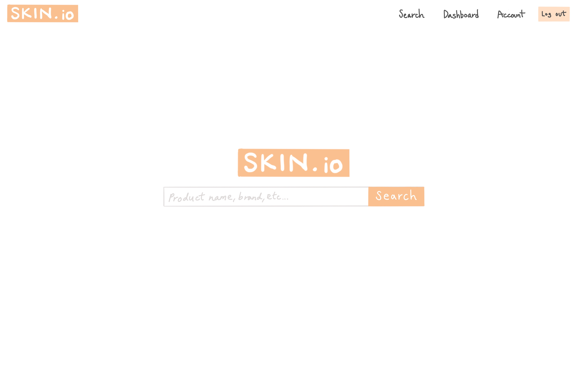
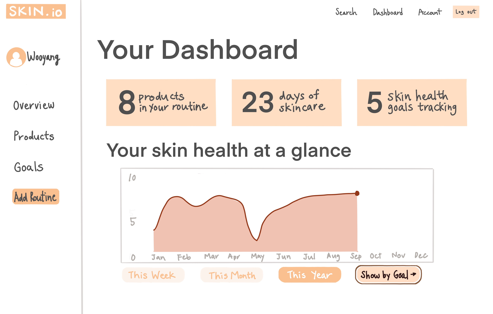
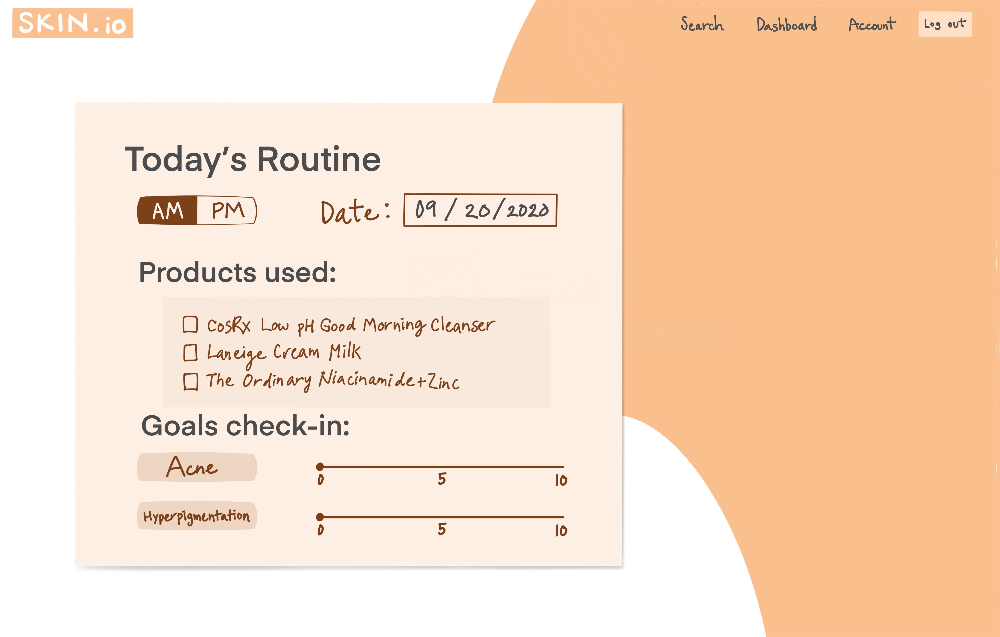
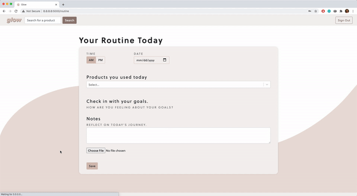
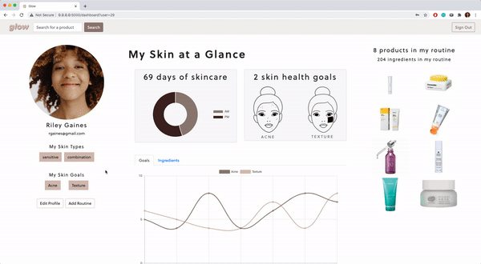
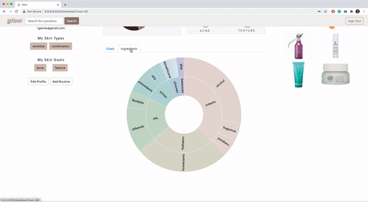

# Glow

Glow is a single-page web application built with React and Flask to log and visualize personalized skincare routines and goals.

## Project Background

For many of us, skin care is an ongoing journey - our skin grows and adapts over time based on many factors around us. And they are not easy to point out when things go wrong. Was it from a moisturizer I used? Maybe the sunscreen?

Glow is a simple yet comprehensive way to track a user's skin health. The app provides tools to recognize patterns of the skin. The app is designed to allow a user to easily document goals and journal routines everyday.  This data over time is aggregated and displayed to the user enabling them to make data-driven insights into why their skin is changing and what products are involved.

## Mock-ups

## Tech Stack

* Javascript -- React, D3.js, Chart.js
* Python -- Flask, SqlAlchemy
* Database -- PostgreSQL
* Styling -- HTML/CSS, React-Bootstrap
* Other Frameworks and APIs -- Cloudinary, React-Select, SkincareAPI, Google Custom Search JSON API

## Feature Highlights

Simple journal entry page to enter skincare routines and update progress on skin goals

Dashboard to display trends in a user's skin health based on past journal entries

Visualizations to help users understand skincare ingredients

## Quickstart

After cloning the repo in your virtualenv, install dependencies:
`$ pip3 install -r requirements.txt`

Then, run the Flask server to start the web app:
`$ python3 server.py`

Visit your `localhost:5000` to access the app in your local browser!

